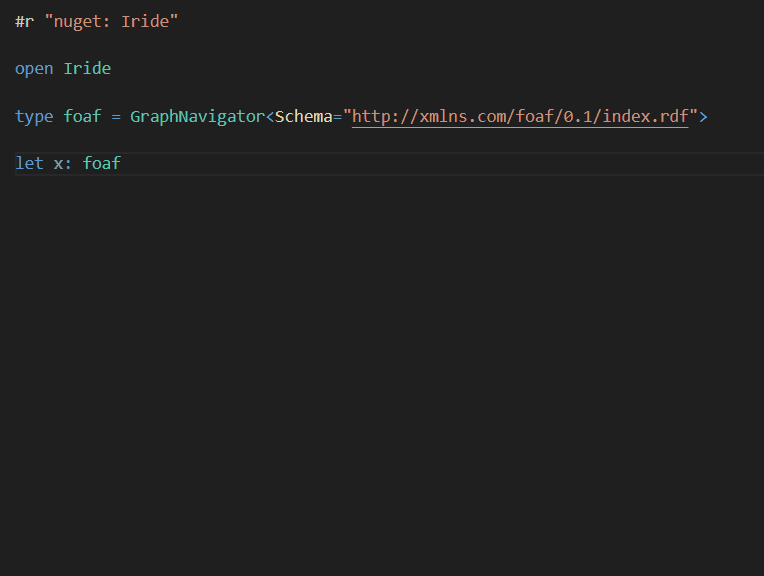
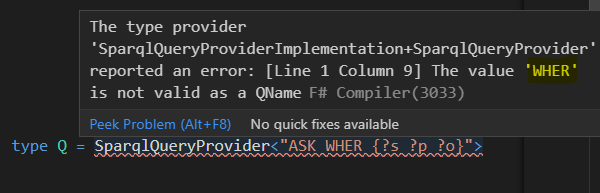
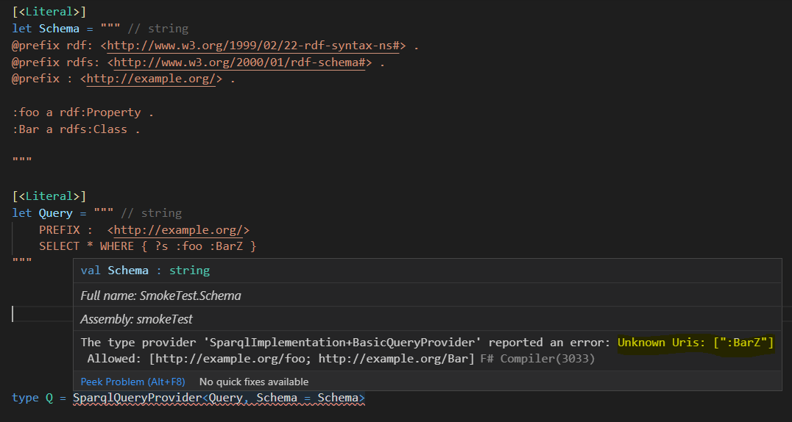

[](https://www.nuget.org/packages/Iride)
[](https://github.com/giacomociti/iride/actions/workflows/build.yml)

This library contains F# [type providers](https://docs.microsoft.com/en-us/dotnet/fsharp/tutorials/type-providers/) for RDF and SPARQL. It is built on top of [dotNetRDF](https://github.com/dotnetrdf/dotnetrdf).




### Reading and writing RDF graphs
_GraphProvider_ helps working with RDF graphs, providing .NET types and members corresponding to RDF classes and properties found in ontologies or in sample data graphs. It can be used also from C# because it's a _generative_ type provider.

 The same reading and writing capabilities are also split in two separate type providers (_GraphNavigator_ and _GraphBuilder_) which, being of the erased kind, can cope with larger ontologies like schema.org.


### Querying RDF with SPARQL

_SparqlQueryProvider_ and _SparqlCommandProvider_ are generative providers
to safely create parametric SPARQL queries and typed wrappers for results.


## Type providers

### GraphProvider

_GraphProvider_ generates types from a schema or from a sample.

Given the following [Turtle](https://www.w3.org/TR/turtle/) sample file _alice.ttl_:

```ttl
@prefix : <http://example.org/> .

:alice a :Person ;
    :age 42 .
```

The type provider infers a type `Person` with a property `Age` and a `Get` factory method returning the instances in a given graph.

```fs
#r "nuget: Iride"

open Iride
open VDS.RDF

type G = GraphProvider<"alice.ttl">

let printAge (graph: IGraph) =
    for person in G.Person.Get(graph) do
        for age in person.Age do
            printfn "%i" age

```

All properties are generated as sequences since RDF allows multiple values.

The same model is obtained using a schema (either [RDFS](https://www.w3.org/TR/rdf-schema/) or [schema.org](schema.org)):

```fs
type G = GraphProvider<Schema = """
    @prefix xsd: <http://www.w3.org/2001/XMLSchema#> .
    @prefix rdfs: <http://www.w3.org/2000/01/rdf-schema#> .
    @prefix : <http://example.org/> .

    :age rdfs:domain :Person ;
         rdfs:range xsd:integer .
    """>
```

Notice also that the parameter, both for the schema and for the sample, can be inline text, a file path or a URL.

### GraphBuilder

GraphBuilder allows to fluently create graphs using a given ontology:

```fs
#r "nuget: Iride" 

open Iride
open VDS.RDF
open Iride.Extensions

type foaf = GraphBuilder<Schema="http://xmlns.com/foaf/0.1/index.rdf">

let graph = new Graph()
graph.NamespaceMap.AddNamespace("", UriFactory.Create "http://example.org/")
graph.NamespaceMap.AddNamespace("foaf", UriFactory.Create "http://xmlns.com/foaf/0.1/")

foaf.Person(graph.Resource ":ann")
    .FirstName("Ann")
    .Knows(foaf.Person(graph.Resource ":bob")
        .FirstName("Bob"))
            
graph.SaveToFile("people.ttl")
```

### GraphNavigator
The file created with the builder:

```ttl
@prefix : <http://example.org/>.
@prefix foaf: <http://xmlns.com/foaf/0.1/>.

:ann a foaf:Person;
     foaf:firstName "Ann";
     foaf:knows :bob.
:bob a foaf:Person;
     foaf:firstName "Bob".
```

can be read with the navigator:

```fs
#r "nuget: Iride" 

open Iride
open VDS.RDF

type foaf = GraphNavigator<Schema="http://xmlns.com/foaf/0.1/index.rdf">

let graph = new Graph()
graph.LoadFromFile("people.ttl")

foaf.Person.Get(graph)
|> Seq.collect (fun x -> x.FirstName)

```

### SparqlQueryProvider

_SparqlQueryProvider_ checks SPARQL queries at design time, in the same vein as [SqlCommandProvider](http://fsprojects.github.io/FSharp.Data.SqlClient/).
For example it detects syntax errors in SPARQL text:



It also provides typed input parameters and (for SELECT queries) typed `Result` objects.
In the following example, the type provider generates a type `Q` with a static method `GetText` and a nested type `Q.Result`.
The former allows to set input parameters (replacing _$INT_ with _42_ in the example).
The latter is a typed wrapper of `SparqlResult` objects, with properties corresponding to
the output variables (`s` and `IRI_p` in the example) of the query.

```fs
open Iride

type Q = SparqlQueryProvider<"SELECT * WHERE { ?s ?IRI_p $INT }">

let exec: string -> VDS.RDF.Query.SparqlResultSet =
    failwith "Use your favourite SPARQL client"

let query = Q.GetText(INT=42)
for r in exec(query) do
    let result = Q.Result(r)
    let subject: VDS.RDF.INode = result.s
    let predicate: System.Uri = result.IRI_p
    // ....
```

In SPARQL, output variables start with
either `?` or `$` but, in practice, only `?` is used.
Hence this library hijacks the prefix `$` to indicate input parameters.

Furthermore, upper case data type hints (e.g. IRI, INT) instruct the type provider to
assign types to parameters and variables.
Notice, however, that triple stores
may return unparseable values due to the schemaless nature of RDF.

Supported data types are IRI, LIT, INT, NUM, DATE, TIME, BOOL.

### SparqlCommandProvider

_SparqlCommandProvider_ behaves like _SparqlQueryProvider_ except that it covers update commands.

```fs
type Cmd = SparqlCommandProvider<"""
    INSERT DATA {$IRI_person <http://example.org/age> $INT_age}
""">

Cmd.GetText(
    IRI_person = System.Uri "http://example.org/p1",
    INT_age = 25)
|> printfn "%s"
// INSERT DATA {<http://example.org/p1> <http://example.org/age> 25 }
```

### UriProvider

_UriProvider_ creates `System.Uri` properties from IRIs in RDF vocabularies.

```fs
type Book = UriProvider<"book.ttl">

let a: System.Uri = Book.author
```

The vocabulary can be either turtle text, a local file or a web resource.
The list of IRIs for which a property is generated is obtained with the following SPARQL query:

```sparql
PREFIX rdfs: <http://www.w3.org/2000/01/rdf-schema#>

SELECT ?uri ?label ?comment WHERE {
  ?uri rdfs:label ?label ;
       rdfs:comment ?comment .
}
```

You can provide your own SPARQL query to customize the set of properties.

### Vocabulary checks

To detect typos in property and class names, it is useful to restrict the accepted vocabulary in queries and commands:



In the example above the type provider reports an error because _BarZ_ is not present in the vocabulary specified by the _Schema_ parameter.
